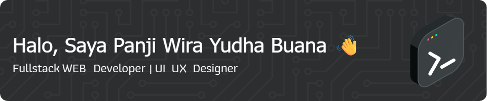

<!-- Header Image -->

  

<!-- Statistik dan Pengikut -->

  
  

---

## 👋 Tentang Saya

Hai! Saya Panji Wira Yudha Buana — seorang **Full-Stack Developer** dan **UI/UX Designer** dengan pengalaman di pengembangan aplikasi **web, mobile, dan sistem IoT**.

- 🎨 Berpengalaman di bidang **UI/UX Design** dan design system berbasis komponen
- 🔭 Sedang mengembangkan: **Sistem IoT Monitoring & Control (ESP32 + Firebase)**
- 🌱 Fokus belajar: **Flutter, .NET Core, Laravel**
- 📫 Email: **buanawirayudhapanji@gmail.com**

Sebagai seorang pengembang yang juga berpengalaman di bidang **UI/UX**, saya percaya bahwa teknologi yang baik harus dibangun dengan pendekatan yang berpusat pada pengguna (_user-centered design_). Saya terbiasa menggunakan pendekatan desain sistematis mulai dari:

- **User Research & Persona Building**
- **Wireframing & Prototyping** dengan Figma
- **Usability Testing** dan iterasi desain
- **Design System** yang konsisten dan responsive

---

## 🧰 Teknologi & Tools

  <!-- Web -->
  
  
  
  
  
  <!-- Mobile & Backend -->
  
  
  
  
  

  <!-- Database & Cloud -->
  
  
  

  <!-- Bahasa Pemrograman -->
  
  
  

  <!-- IoT -->
  
  
  
  

---

## 🚀 Proyek Terbaru

🛏️ **Aplikasi Booking Hotel**  
Flutter-based aplikasi booking hotel yang responsif dan terintegrasi dengan Firebase.

🔐 **RESTful API + JWT Auth**  
Backend ASP.NET Core dengan autentikasi JWT dan sistem manajemen user modern.

🐟 **Sistem IoT Monitoring & Kontrol**  
Menggunakan ESP32 + Firebase untuk pemantauan suhu, hama, dan pemberian pakan otomatis.

---

## 📊 Statistik GitHub

  
    
  
    
  

---

## 📬 Terhubung dengan Saya

  
  
  

---

  

